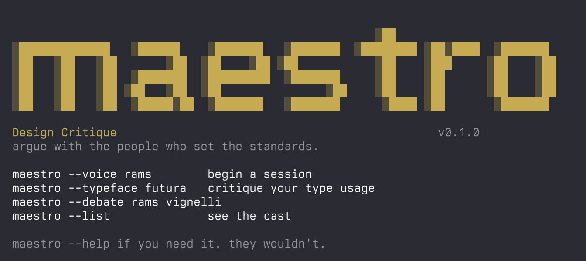

# maestro

a CLI that lets designers argue with the dead.



describe your work. get feedback from people who defined the standards — and who would have hated most of what you've made.

## install

```
npm install -g maestro-cli
```

or run directly:

```
npx maestro-cli --voice rams
```

## use

```
maestro --voice rams
maestro --typeface baskerville
maestro --debate rams vignelli
maestro --list
```

## how it works

each session starts with three questions before any feedback.
answer them. the feedback lands differently when you've
had to articulate the problem first.

sessions save to `~/.maestro/sessions/`

type `/save` during a session to save a checkpoint.
type `/quit` or `/q` to end.

## the cast

### voices

```
rams          product, reduction. "what have you removed?"
vignelli      grid, type, identity. "how many typefaces?"
eames         systems, joy. "does it do what it says honestly?"
morris        craft, ethics. "who benefits from this existing?"
albers        colour, perception. "what does it do next to its neighbour?"
rand          identity, simplicity. "does it work in black?"
tschichold    typography, hierarchy. "could it work without colour?"
tufte         data, clarity. "what is the data-ink ratio?"
warde         type as vessel. "do they notice the type or the meaning?"
bringhurst    rhythm, proportion. "what is the measure?"
```

### typefaces

```
baskerville   john baskerville, 1757. legibility, contrast.
futura        paul renner, 1927. geometry as democracy.
helvetica     max miedinger, 1957. neutrality as intention.
gill-sans     eric gill, 1928. humanist geometry.
garamond      claude garamond, 1530s. the page as breath.
univers       adrian frutiger, 1957. the system.
akzidenz      anon, berthold, 1898. function before authorship.
```

## modes

**voice** — describe your work. the voice asks three questions before giving any feedback. you answer. they give their verdict.

**typeface** — describe how you're using the typeface. the designer reviews it from their documented position.

**debate** — two voices in the room. you describe your work. they argue about it. you moderate.

## what it is not

not a validator. not a generator. not a yes machine.
a resistance tool. it slows you down deliberately.

## setup

run `maestro --voice rams` and it will walk you through setup on first run. pick your provider, paste your key.

or set an environment variable:

```
export ANTHROPIC_API_KEY=sk-ant-...
# or
export OPENAI_API_KEY=sk-...
```

both work. if both are set, anthropic is used by default.
override with `--provider openai` or `--provider anthropic`.

config saves to `~/.maestro/config.json`

## requirements

- node.js 18+
- an API key from [anthropic](https://console.anthropic.com/) or [openai](https://platform.openai.com/)

## license

MIT

---

made by [stanley wood](https://stanleywood.co)
